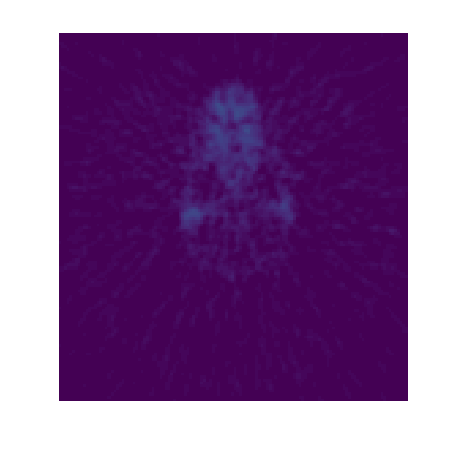
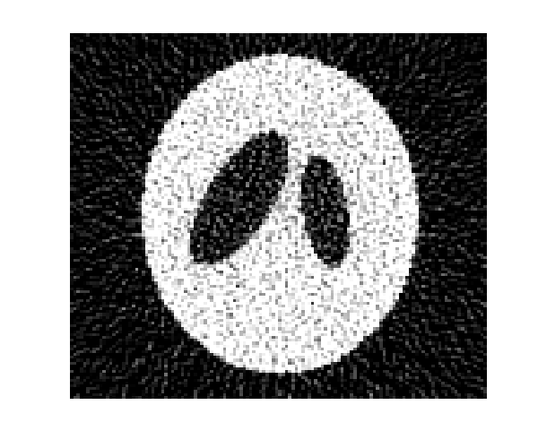
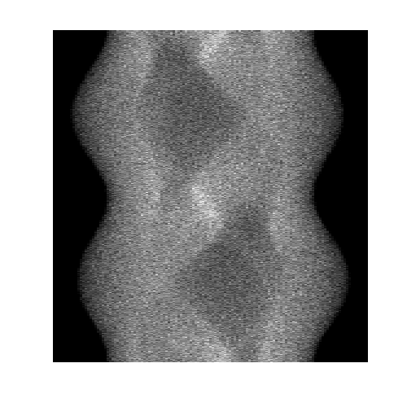

# Weighted ray / Radon transforms in 3D

  
  
  

This is project arose as a  part of my phd thesis conducted under the supervision of professor [Roman Novikov](http://www.cmap.polytechnique.fr/~novikov/). 
The thesis is now [here](http://www.theses.fr/2019SACLX029). This page I update very rarely, hopefully, this will change.

The big goal is to develop new inversion methods for weighted (generalized) Radon transforms in Euclidean space. 
The latter are of particular importance in various applications in the domain of inverse 
problems (e.g., in tomographies, geophysics). In particular, we work on methods which 
could be numerically more stable against the noise in tomographical data in SPECT. 

The small goal is to put online some useful implementations on Radon-type transforms and tomography.
This helps to keep track of my own codes and, in addition, could be of use for students of MIPT
passing the fall course "Tomography and inverse scattering problem". 

## Some information about ray / Radon transforms

Here it will be the link to a pdf file with minimal information about the subject. 

## Sructure of the project

Here I briefly explain for what each program is folder contains. 
Details about compilation, usage, input/output, parameters, usage, etc., 
you can find in README.md in respective folders.

  * #### bash (bash)
        Scripts in bash for automatization of simulation-reconstruction processes. These use the compiled codes 
		in folders below. 

  * #### radon-inversion (Matlab / Octave / Python)
        Octave/Matlab/Python scripts for inversion of classical Radon transforms in 2D/3D
  
  * #### radon-sampling (C)
        C codes for simulating classical and weighted Radon transforms in 3D (along hyperplanes in 3D)
  
  * #### ray-sampling (C)
        C codes for simulating classical and weighted ray transforms in 3D (along oriented lines in 3D)
		for lines that are parallel XY-plane. This corresponds to scanner geometry, where the ray data are 
		acquired in a set of parallel slices. 
		
  * #### reduction-algorithm (C)
        This is the code related to the article : 
		F. O. Goncharov, A geometric based preprocessing for weighted ray transforms with applications
		in SPECT, arxiv:1911.05470
		Basically, codes here allow to reduce data given weighted ray transforms in 3D (for example, 
		those produced by 'ray_sampling') to weighted Radon transforms in 3D along planes. 
		To understand, why it is worth of anything, look in the preprint above.
  
  * #### umot (C / Python) 
        These codes are related to simulations and inversions of weighted Radon transforms in 2D 
		arising in ultrasound-modulated optical tomography (UMOT).
		
  * #### ver-python (Python)
        Codes in Python such as : simulation and inversion of Radon transforms in 2D, adjoint Radon transforms, 
		computations of system-matrices in 2D for X-ray, PET, SPECT (I don't pursue write anything for 3D in 
		Python because it becomes too slow, in C it is anyway faster)
  
  * #### weights-utilities (C)
        Computations of weight-expansions for SPECT in 2D/3D.
		
  * #### EM-algorithms (C / Python)
        Not a secret that EM-algorithms are extremely popular in tomographies, however, they no longer use Radon transforms (at least not explicitly). 
		Here we place some implementations, inspired from lectures of prof. J. Fessler from the University of Michigan. 

  * #### gradient-algorithms (C / Python / Matlab / Octave)
        Some gradient algorithms (e.g., coordinate-wise descent) converge first at high-frequencies. Therefore, low-frequency initial approximations (from FBP for example)
		are of definite interest for application of these gradient schems in tomography. My interest here is to apply our approach : reduction from Pw to Rw -> FBP / Chang formula -> 
		gradient descent, and to see the results. 
		
		
## Future plans

  * Write some sustainable documentation for given codes. 
  * Make use of advanced, growing libraries in tomographical imaging (e.g., CASToR project castor-project.org)
  * Implement some algorithms from machine-learning community (ANN's, Bayesian methdos etc.)
      
      

