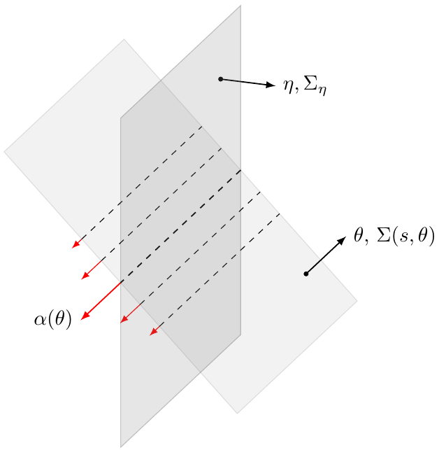

## General information

Program performs rebining of (weighted) ray transforms of a
function into 3D Radon transforms along 2-planes.

One may think here of classical ray transforms (however, similar holds
for weighted too). If classical ray transforms in the _slice-by-slice framework_
are known, they can be used to compute Radon transforms in 3D along 2-planes.
This comes from the fact that a 2-plane can be _fibered_ into a series of parallel
lines along which integrals are known (see image below).

On the input ray transforms with parameters are provided (**nshift**,
  **nphi**, **nslices**) (see also ray-sampling for details).
Program performs quadratic interpolations in space of ray transforms
to compute plane integrals.  

Radon transforms are computed for planes that correspond to to grid with
parameters (**nshift**, **nphi**, **ntheta**), where first two are
the same as for ray transforms and the last one is provided by the user.

**NOTE**: It is assumed that the test-function is supported in the ball,
inscribed in the cube (**nslices** x **nslices** x **nslices**).

It is possible to run the code in parallel, when work is shared uniformly
among in shift-variable among the threads.

## Compilation
    make
    make clean

## Requirements
    gcc, openmp, GSL library

## Input arguments
    -h --help     no_arg      Display usage information.
    -p --nphi     integer     Number of projections per slice in ray data/phi angles in Radon data.
    -s --nshift   integer     Number of shifts for ray and Radon data.
    -t --ntheta   integer     Number of theta angles for Radon data.
    -z --nslices  integer     Number of z-slices in ray data.
    -i --input    string      Read data given by ray transforms from a file.
    -o --output   string      Write output data to the file.
    -n --nthreads integer     Number of OpenMP threads for parallelization.
    -v --verbose  no_arg      Print additional information during computations.

## Output
  binary file with float array for Radon transforms
  Order in float array is the following:

      for shift in shift_array
        for phi in phi_array
          for theta in theta_array
            radon_transform(f)(shift, phi, theta)
          endfor
        endfor
      endfor

## Usage / Examples

    :$ ./radon_reduction -p 128 -s 128 -t 128 -z 128 -i input_ray_data.bin -o output_radon_data.bin
